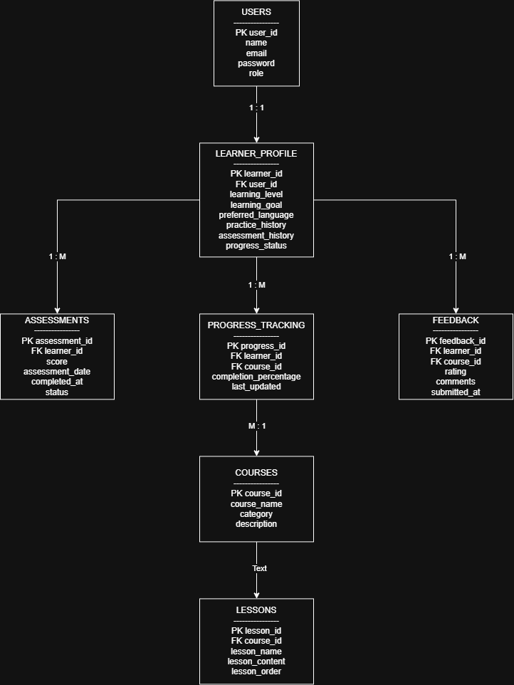

# Database Schema

## AI-Powered Sign Language Learning & Assessment Platform

## Table 1 : Users 
| Column Name |     Data Type     |           Description                   |
|-------------|-------------------|-----------------------------------------|
|   user_id   | INT (Primary Key) | Unique ID for each user                 |
|    name     |   VARCHAR(100)    | Full name of the user                   |
|    email    |   VARCHAR(150)    | Email address of the user               |
|   password  |   VARCHAR(255)    | Stores the user's encrypted password    |
|    role     |   VARCHAR(50)     | Defines the user's role in the platform |

## Table 2 : Learner_Profile
| Column Name        |     Data Type     |                    Description                            |
|--------------------|-------------------|-----------------------------------------------------------|
| learner_id         | INT (Primary Key) | Unique ID for each learner                                |
| user_id            | INT (Foreign Key) | References the user in the Users table                    |
| learning_level     | VARCHAR(50)       | Current learning level (Beginner, Intermediate, Advanced) |
| learning_goal      | VARCHAR(255)      | Goal set by the learner                                   |
| preferred_language | VARCHAR(50)       | Preferred language for learning                           |
| practice_history   | TEXT              | Stores the learner's practice records                     |
| assessment_history | TEXT              | Stores previous assessment records                        |
| progress_status    | VARCHAR(50)       | Current learning progress of the learner                  |

## Table 3 : Courses
| Column Name |      Data Type    |       Description                  |
|-------------|-------------------|------------------------------------|
| course_id   | INT (Primary Key) | Unique ID for each course          |
| course_name | VARCHAR(100)      | Name of the sign language course   |
| category    | VARCHAR(50)       | Category of the course             |
| description | TEXT              | Detailed description of the course |

## Table 4 : Lessons
|   Column Name  |     Data Type     |                 Description                       |
|----------------|-------------------|---------------------------------------------------|
| lesson_id      | INT (Primary Key) | Unique ID for each lesson                         |
| course_id      | INT (Foreign Key) | References the course to which the lesson belongs |
| lesson_name    | VARCHAR(100)      | Name of the lesson                                |
| lesson_content | TEXT              | Learning content for the lesson                   |
| lesson_order   | INT               | Sequence number of the lesson in the course       |

## Table 5 : Assessments
|   Column Name   |     Data Type     |                Description                      |
|-----------------|-------------------|-------------------------------------------------|
| assessment_id   | INT (Primary Key) | Unique ID for each assessment                   |
| learner_id      | INT (Foreign Key) | References the learner taking the assessment    |
| score           | DECIMAL(5,2)      | Score obtained in the assessment                |
| assessment_date | DATE              | Date on which the assessment was taken          |
| completed_at    | DATETIME          | Date and time when the assessment was completed |
| status          | VARCHAR(50)       | Assessment status (Completed, Pending, Failed)  |

## Table 6 : Progress_Tracking
|      Column Name      |      Data Type    |                      Description                       |
|-----------------------|-------------------|--------------------------------------------------------|
| progress_id           | INT (Primary Key) | Unique ID for each progress record                     |
| learner_id            | INT (Foreign Key) | References the learner whose progress is being tracked |
| course_id             | INT (Foreign Key) | References the course being tracked                    |
| completion_percentage | DECIMAL(5,2)      | Percentage of the course completed by the learner      |
| last_updated          | DATETIME          | Date and time when the progress was last updated       |

## Table 7 : Feedback
|  Column Name |     Data Type     |                   Description                     |
|--------------|-------------------|---------------------------------------------------|
| feedback_id  | INT (Primary Key) | Unique ID for each feedback                       |
| learner_id   | INT (Foreign Key) | References the learner providing feedback         |
| course_id    | INT (Foreign Key) | References the course for which feedback is given |
| rating       | INT               | Rating given by the learner (1–5)                 |
| comments     | TEXT              | Feedback comments provided by the learner         |
| submitted_at | DATETIME          | Date and time when the feedback was submitted     |

## Database Relationships
- Users → Learner_Profile (One-to-One)
- Courses → Lessons (One-to-Many)
- Learner_Profile → Assessments (One-to-Many)
- Learner_Profile → Progress_Tracking (One-to-Many)
- Courses → Feedback (One-to-Many)
- Learner_Profile → Feedback (One-to-Many)

## ER_diagram

## Database Design Notes
- Each table has a Primary Key to uniquely identify records.
- Foreign Keys are used to establish relationships between tables.
- The schema is normalized to reduce data redundancy.
- Separate tables improve maintainability and scalability.
- The design supports learner management, course management, assessments, progress tracking, and feedback.

## Conclusion
The database design for the AI-Powered Sign Language Learning & Assessment Platform helps to store and manage all important information like users, courses, lessons, assessments, learner progress, and feedback.
Primary Keys and Foreign Keys are used to connect the tables properly and keep the data accurate. The database structure is organized to avoid duplicate data and make the system easy to manage.
This design provides a strong base for developing the platform and helps in adding future features like AI-based sign recognition and personalized learning.