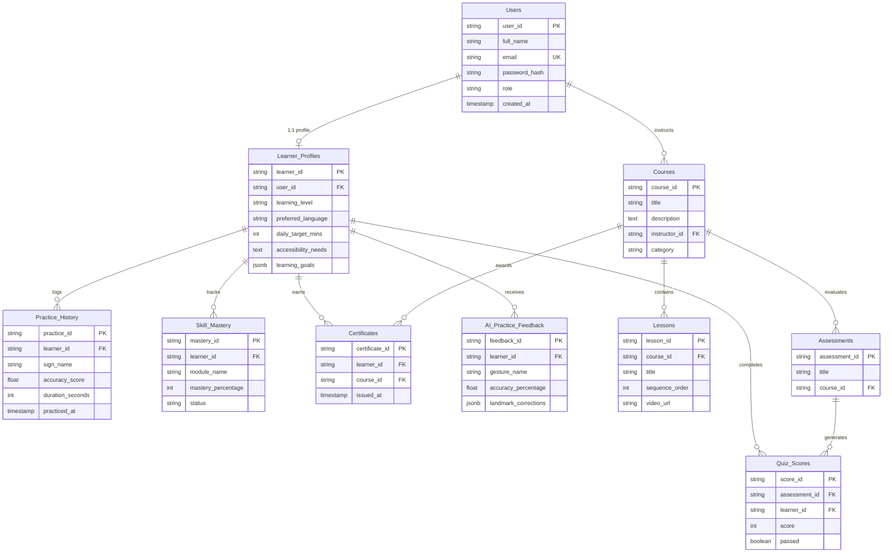

# 🗄️ Pragathi's Database Schema & ER Diagram
**Infosys Springboard Internship 2026 — Team 4**

---

## 📌 Relational Entity Relationship (ER) Diagram

---

## 📋 10 Relational Tables Overview

1. **`Users`**: Stores core authentication details and 4 operational roles (`LEARNER`, `INSTRUCTOR`, `TRAINER`, `ADMIN`).
2. **`Learner_Profiles`**: Foreign key linked (`user_id`) storing learning levels, preferred languages, and daily practice targets.
3. **`Courses`**: Course catalog managed by Instructors.
4. **`Lessons`**: Ordered video curriculum modules.
5. **`Practice_History`**: Standardized foreign key (`learner_id`) logging sign gesture practice duration and accuracy.
6. **`Skill_Mastery`**: Tracks module completion percentages and proficiency statuses.
7. **`Assessments`**: Course evaluation assessments.
8. **`Quiz_Scores`**: Stores learner test performance.
9. **`Certificates`**: Verified course completion certificates.
10. **`AI_Practice_Feedback`**: Stores real-time MediaPipe hand landmark feedback and correction data.
