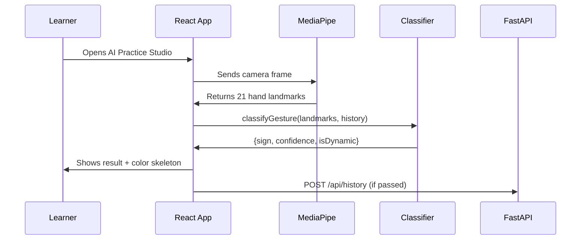

# Rishi — Workflow Analyst
## Infosys Springboard 2026 · Team 4 · SignLearn AI

### My Role
Workflow Analyst — Designed system architecture, user journey workflows, and Mermaid sequence diagrams for all major user flows.

### What I Built

#### System Architecture Workflows (`workflows/`)
| Document | Description |
|---|---|
| `workflows/Milestone2_Workflows.md` | Complete M2 workflow specs with Mermaid diagrams |
| `workflows/workflows.md` | Core system workflows — registration, practice, quiz |
| `Sign_Language_Learning_Workflows.md` | Full learner journey from onboarding to certification |

#### Workflow Diagrams Produced
1. **User Registration Flow** — Role selection → profile setup → dashboard
2. **Live AI Practice Flow** — Camera open → MediaPipe detect → classify → score → log
3. **Speed Quiz Flow** — Timer start → question → answer → auto-advance → grade
4. **Leaderboard Update Flow** — Session complete → score calc → rank update → notify
5. **Exception Handling Flow** — Low confidence → lighting warning → retry guidance
6. **Instructor Dashboard Flow** — Student list → at-risk detection → nudge send
7. **Course Enrollment Flow** — Browse → enroll → lesson → video → mark done → progress

#### Mermaid Sequence Diagrams (from `workflows.md`)

### Branch
`Rishi_team4/week2-milestone2`

---
*Infosys Springboard Internship 2026 | Team 4 | SignLearn AI*

---

## 📁 Milestone 3 — My Deliverables (`Milestone3/`)
| File | What I Built |
|---|---|
| `workflows/Milestone2_Workflows.md` | M2 workflow specs including gesture practice flow |
| `workflows/workflows.md` | Core system workflows |
| `workflows/Sign_Language_Learning_Workflows.md` | Full learner journey |
| `docs/Milestone3_Progress_Report.md` | Official M3 progress report |

**M3 Sequence Diagrams I Created:**
1. **Live AI Practice Flow** — Camera → MediaPipe → Classifier → Score → Log
2. **Exception Handling** — Low confidence → lighting warning → retry guidance
3. **Dual-hand Detection** — Right-hand (blue) vs Left-hand (orange) routing
4. **Session Completion** — Pass/fail → history log → streak update

## 📁 Milestone 4 — My Deliverables (`Milestone4/`)
| File | What I Built |
|---|---|
| `workflows/workflows.md` | Updated with M4 flows (leaderboard, courses, quiz) |
| `workflows/Milestone2_Workflows.md` | Reference base |
| `docs/Milestone4_Final_Report.md` | Official M4 final report |
| `docs/System_Architecture.md` | Full system architecture diagram |

**M4 Workflow Diagrams I Created:**
1. **Course Enrollment Flow** — Browse → enroll → lesson → video → mark done
2. **Speed Quiz Flow** — Timer start → question → 20s countdown → grade → review
3. **Leaderboard Update Flow** — Session end → score calc → rank update → notify
4. **Instructor Monitoring Flow** — Student list → at-risk detect → nudge send
5. **JWT Auth Flow** — Register → hash password → issue JWT → protected routes
