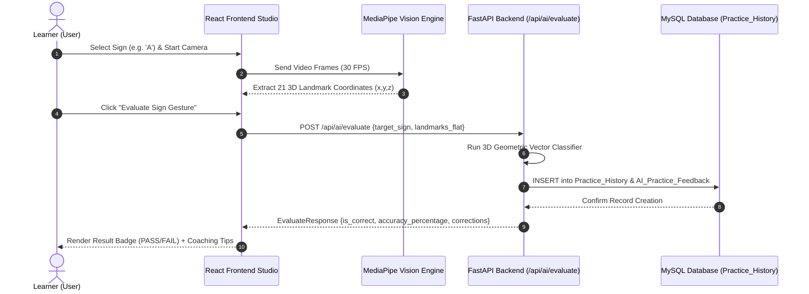
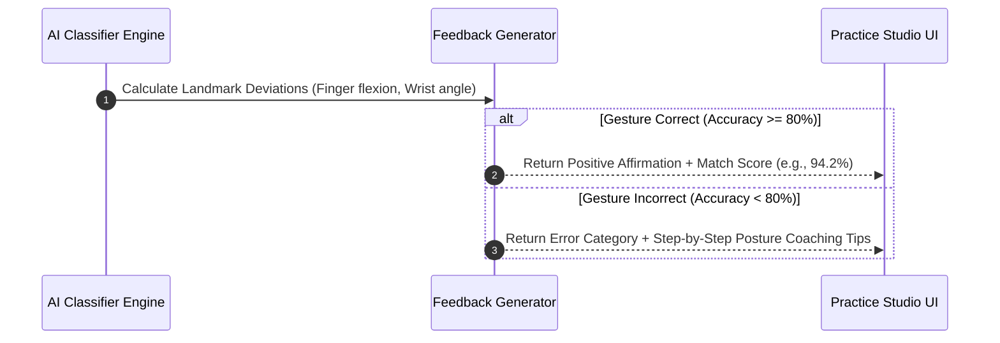
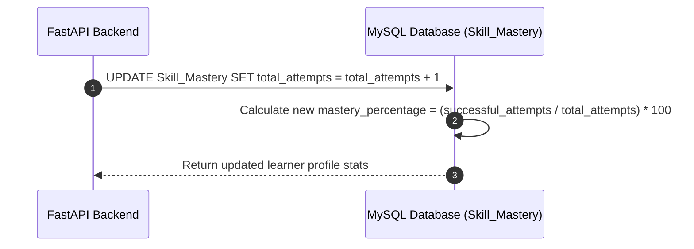

# Milestone 2 — Sign Language Learning & AI Gesture Workflows
**Author**: Rishi (Workflow & Sequence Architect) | **Team 4 — Infosys Springboard Internship 2026**

---

## 🔄 1. Overview of System Workflows

Milestone 2 introduces three core interactive workflows for the platform:
1. **AI Gesture Practice Session & Evaluation Flow**
2. **Real-Time Automated Feedback & Posture Coaching Loop**
3. **Learner Skill Mastery Recalculation Flow**

---

## 📊 2. Workflow Sequence Diagrams

### Workflow 1: AI Gesture Practice Session & Evaluation Flow

### Workflow 2: Automated Feedback Loop & Posture Coaching

### Workflow 3: Learner Skill Mastery Recalculation Flow

