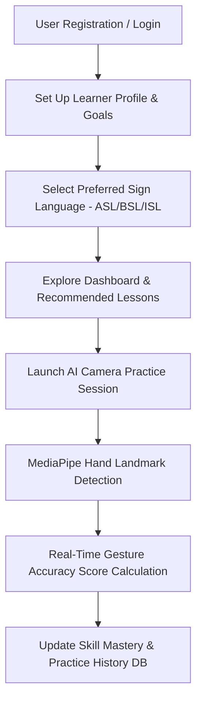

# Rishi's Sign Language Learning Workflows (`team_master/workflows/workflows.md`)

```mermaid
graph TD
    A[User Registration / Login] --> B[Set Up Learner Profile & Goals]
    B --> C[Select Preferred Sign Language - ASL/BSL/ISL]
    C --> D[Explore Dashboard & Recommended Lessons]
    D --> E[Launch AI Camera Practice Session]
    E --> F[MediaPipe Hand Landmark Detection]
    F --> G[Real-Time Gesture Accuracy Score Calculation]
    G --> H[Update Skill Mastery & Practice History DB]
```
