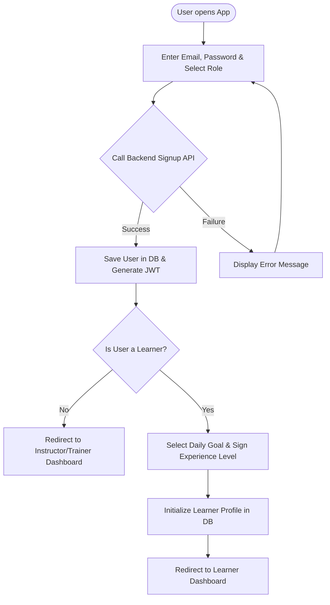
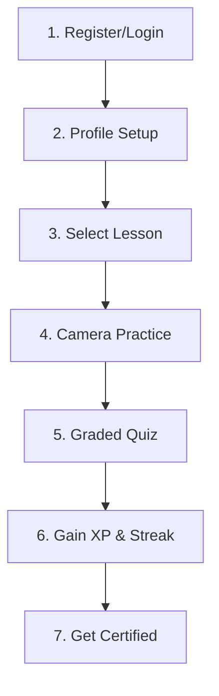
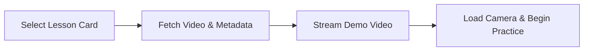
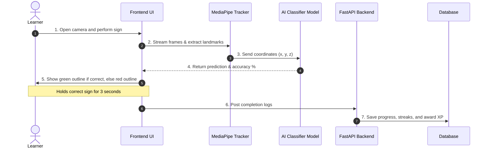
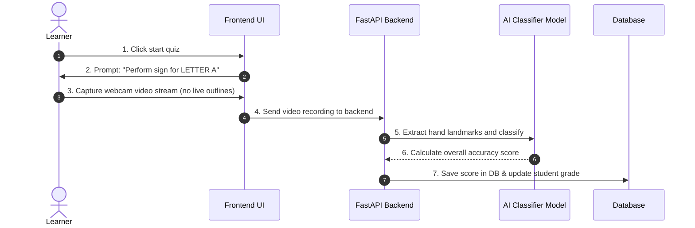
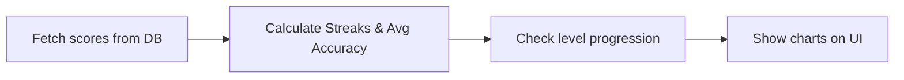

# Software Engineering Workflow Specification
## Module: Plan Application Workflows
**Author**: Rishi Kumar (Branch: `Rishi_team4/week1`)  
**Project**: AI-Powered Sign Language Learning & Assessment Platform  
**Internship**: Team 4 - Infosys Springboard Internship 2026  

---

## 1. Introduction & Objectives

### 1.1 Purpose of the Learning Workflows
The learning workflows describe the visual pathways and backend processes that make our platform function. This document helps the frontend and backend developers build a seamless user experience, guiding users from registration to daily sign practice and final certification.

### 1.2 Main Goals
*   **Map out User Journeys**: Explain how a user signs up, starts a lesson, and gets evaluated.
*   **Explain the Camera Practice Loop**: Detail how the browser reads webcam video, tracks hand shapes using MediaPipe, and shows instant feedback.
*   **Define Database Storage**: Highlight when and where the database reads or writes data during user activities.
*   **Draft Error Scenarios**: Create clear paths to recover when the camera is blocked, lighting is poor, or internet drops.
*   **Incorporate Progression Logic**: Set rules for rewarding XP points, streaks, badges, and recommending next lessons.

---

## 2. End-to-End Learner Journey

This table explains the 12 stages a learner goes through in the app, detailing user actions, system responses, and database writes.

| # | Stage | What User Does | What System / AI Does | Database Write Action |
| :-: | :--- | :--- | :--- | :--- |
| **1** | Registration | Signs up or logs in | Checks login; issues JWT token | Creates new user row in `Users` |
| **2** | Profile Setup | Enters goals & preferred language | Saves user choices | Writes to `learner_profiles` |
| **3** | Diagnostic | Signs simple prompt words | Estimates baseline skill level | Writes to `assessment_results` |
| **4** | Path Select | Selects recommended path | Unlocks matching lessons | Writes to `learner_path` |
| **5** | Lesson Select | Clicks on a lesson card | Loads text and videos | Reads from `lessons` and `modules` |
| **6** | Content View | Watches instruction video | Tracks playback progress | Writes to `content_progress` |
| **7** | Camera Practice | Makes the sign on camera | Runs hand tracker & AI check | Writes attempt to `practice_history` |
| **8** | Live Feedback | Sees red/green outlines | Gives instant error correction | Writes to `feedback_log` |
| **9** | Graded Quiz | Takes an unguided test | Scores gesture accuracy | Writes final mark to `quiz_scores` |
| **10** | Dashboard View | Checks overall score/stats | Compiles metrics for charts | Reads from `progress_tracking` |
| **11** | Unlock Next | Proceeds to next level | Checks completion limits | Writes to `unlocked_lessons` |
| **12** | Certify | Passes final exam | Creates verified PDF download | Writes certificate ID to `certificates` |

---

## 3. App Modes & Learner Workflows

### 3.1 New Learner Onboarding Flow
When a new user signs up, they select their role (like Learner) and set their daily study goals (like 15 mins a day) and experience level. The system saves this in the database to build their profile and recommend a starting point.

### 3.2 Returning Learner Resume Flow
Returning users skip setup. The app reads their saved login token, pulls their streak count and past progress from the database, and redirects them to the lesson they were working on last.

### 3.3 Practice Mode (Ungraded)
Practice Mode is ungraded and repeatable. The webcam runs in a loop to track the user's hand and show helpful colored outlines (green for correct, red for incorrect) alongside text tips. Practice attempts do not count toward quiz grades.

### 3.4 Assessment Mode (Graded)
In Assessment Mode (or quizzes), all helpful green/red outlines and corrective tips are turned off. The system records the user's camera feed, classifies their sign, and writes the accuracy score directly to the database. Passing unlocks the next lesson.

### 3.5 Revision Mode (Custom Review)
This mode automatically creates a review session for letters or words that the user struggled with in previous sessions (based on low scores logged in the feedback history).

---

## 4. Core Flowcharts

### Main Application Workflow

### Lesson Fetching & Demonstration

---

## 5. Core Practice & AI Feedback Loop

The practice loop captures frames from the webcam, tracks 21 points on the hand, classifies the gesture, and returns immediate green/red outlines.

### Webcam Practice Loop Sequence

---

## 6. Graded Assessment & Progress Analytics

The quiz workflow evaluates student sign accuracy under testing conditions and compiles completion percentages to update dashboard metrics.

### Graded Quiz & Video Assessment Sequence

### Progress Tracking and Score Analytics Flow

---

## 7. Database Read / Write Details

This section outlines what details are read from or written to database tables during the key workflow phases.

| Workflow Stage | Database Table | Fields Saved or Retrieved |
| :--- | :--- | :--- |
| **Registration / Login** | `Users` Table | Saves `user_id`, `email`, `password_hash`, and `role` |
| **Profile Setup** | `Learner_Profile` Table | Saves `learning_level`, `learning_goal`, and `preferred_language` |
| **Diagnostic Assessment** | `Assessments` Table | Saves diagnostic scores, completion timestamps, and level |
| **Lesson Content Load** | `Courses`, `Lessons` Tables | Retrieves `lesson_name`, course order, and tutorial content |
| **Camera-Based Practice** | `Progress_Tracking` Table | Saves `completion_percentage` and `last_updated` timestamp |
| **Real-Time Feedback** | `Feedback` Table | Saves feedback comments, rating, and date submitted |
| **Quiz / Final Exam** | `Assessments` Table | Saves final quiz score, date taken, and pass/fail status |
| **XP / Daily Streaks** | `Learner_Profile` Table | Updates `streak_count`, XP total, and list of unlocked lessons |

### Real-Time AI Pipeline Stages
1.  **Webcam Stream**: Browser captures video frame sequences at 25-30 frames per second.
2.  **Landmark Tracking**: MediaPipe Hands locates the hand shape and maps it to 21 joint keypoints ($x$, $y$, $z$ coordinates).
3.  **AI Classification**: FastAPI loads the CNN model (for letters) or LSTM (for words) to compare user hand joints with reference joints.
4.  **Feedback Render**: System outputs a score. A green outline is drawn on the camera screen if the score is $\ge 80\%$, else a red outline is shown with correction tips.

---

## 8. Technical Operations, Error Recovery & Progress Rules

### Error Detection & System Recovery Paths

| Failure Scenario | Detection Point | Automated Recovery Action |
| :--- | :--- | :--- |
| **Webcam blocked / denied** | Browser MediaDevices check fails | Show warning alert; prompt user to grant permission in browser |
| **Room is too dark** | Hand tracking confidence < 40% | Overlay prompt suggesting better lighting or adjusting angles |
| **Hand out of camera bounds** | MediaPipe registers 0 tracked points | Draw hand placement box guide on screen; pause tracking |
| **Internet connection drops** | WebSocket connection fails | Show offline banner; cache practice history in browser memory |
| **Low-confidence prediction** | Classifier probability score < 60% | Withhold grading; prompt to try again or watch tutorial video |

### Gamification & Score Rules
*   **Daily Streaks**: Increments by 1 every day the learner completes a practice. Resets to 0 if a full calendar day is missed.
*   **XP Point Scoring**: Completing a lesson yields 10 XP, passing a quiz yields 30 XP, and final certification exam yields 100 XP.
*   **Overall Score Formula**:
    $$\text{Score} = 40\%(\text{Gesture Accuracy}) + 25\%(\text{Quiz Marks}) + 15\%(\text{Completion}) + 10\%(\text{Streak}) + 10\%(\text{Rate of Improvement})$$

### Adaptive Recommendation Rules
*   **Accuracy Thresholds**: If average accuracy falls below 60%, intermediate lessons are locked, and basic review exercises are suggested.
*   **Milestone Skips**: If accuracy exceeds 90% with low response times, the system suggests skipping ahead to advanced blocks.
*   **Mistake Review Lists**: Failed letters or words are logged and pushed to the top of the user's review dashboard.
