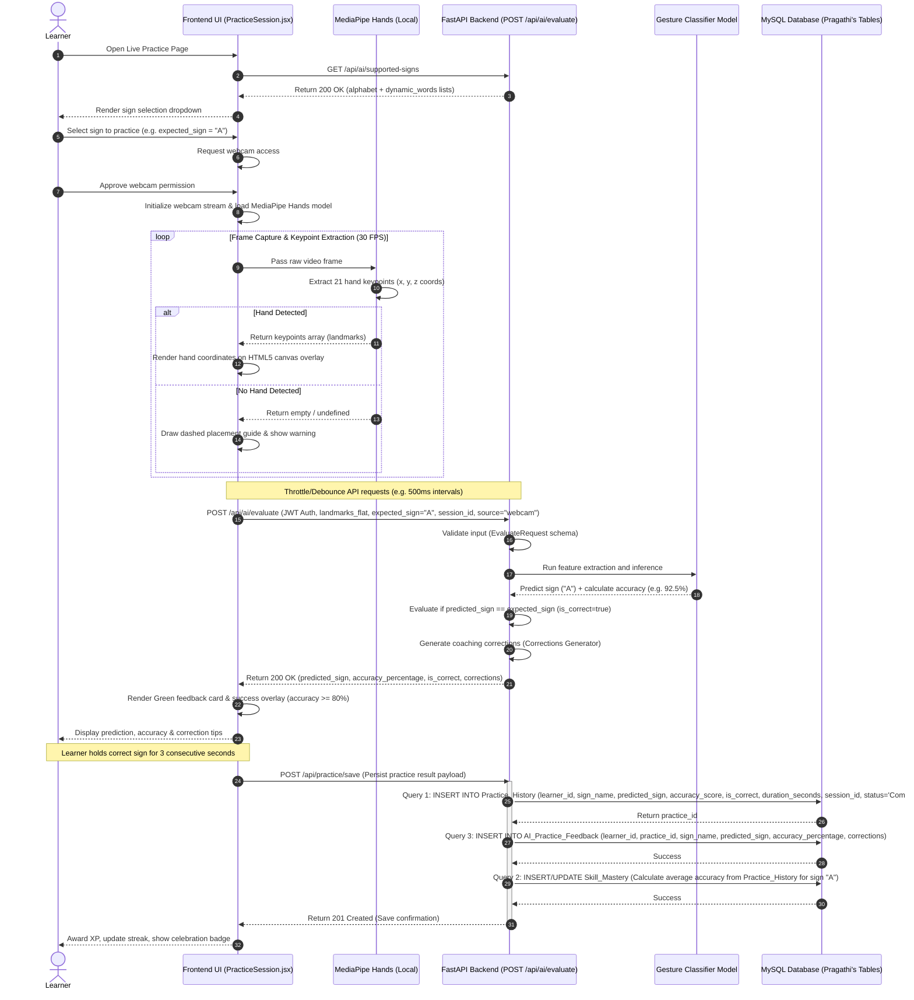
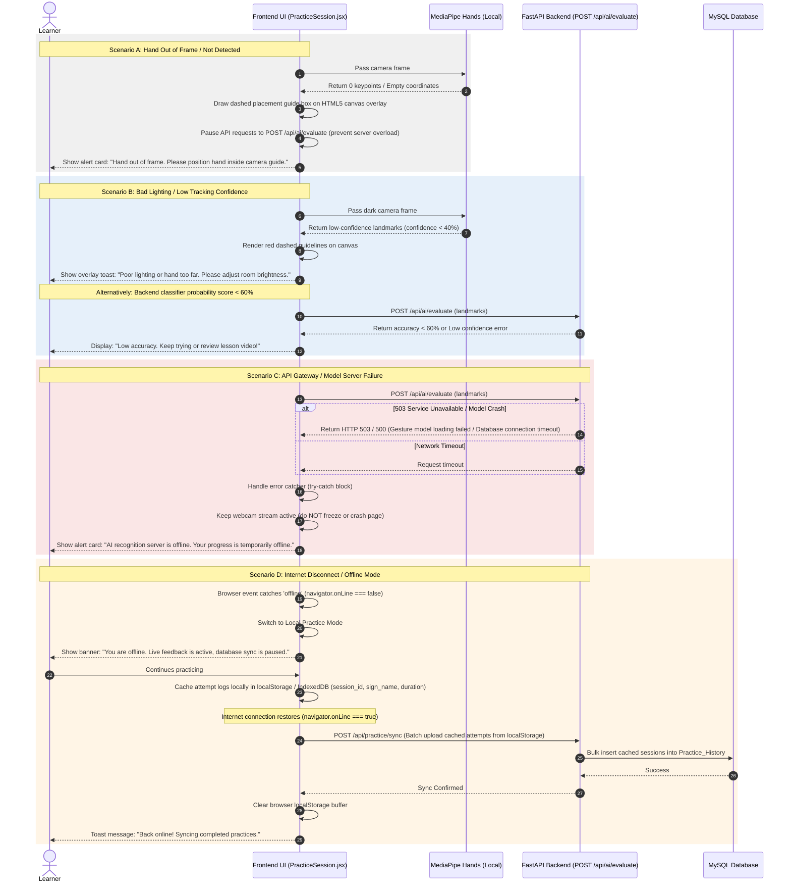
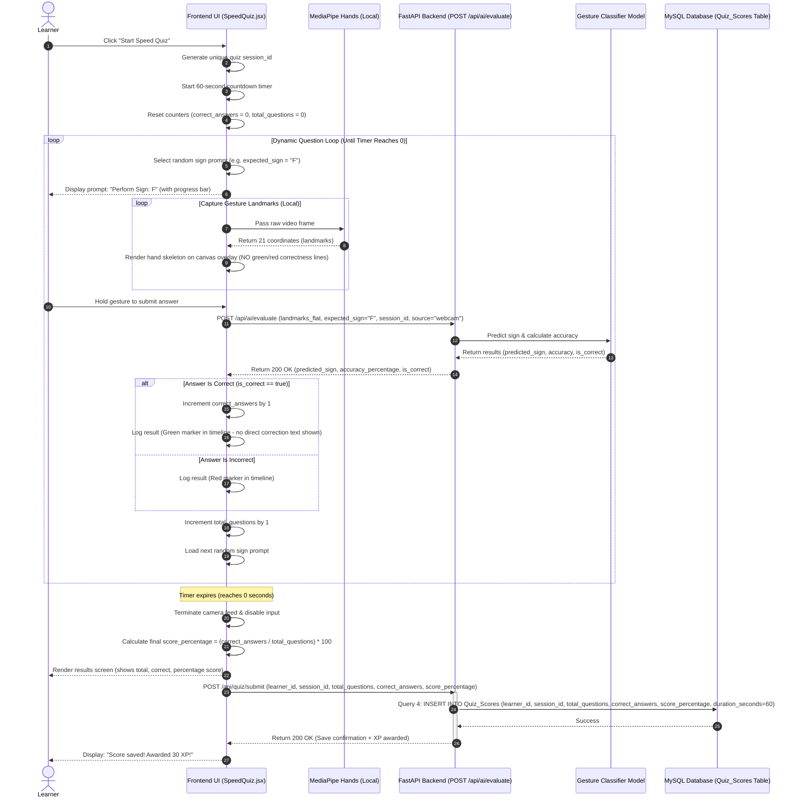

# Software Engineering Workflow Specification

## Module: Plan Application Workflows (Milestone 2)
*   **Author**: Rishi Kumar (Branch: `Rishi_team4/week2-milestone2`)
*   **Project**: AI-Powered Sign Language Learning & Assessment Platform
*   **Internship**: Team 4 - Infosys Springboard Internship 2026

---

## 1. Introduction & Context

This document specifies the technical sequence flows of the platform's core interactive modules after Phase 1 completion. It maps the runtime interactions between:
*   **Frontend UI Client**: Built in React (Vite), containing webcam view controllers, canvas rendering logic, and local token storage.
*   **MediaPipe Hands SDK**: Loaded directly in the browser's JavaScript environment to extract hand joint coordinates.
*   **FastAPI Backend Service**: Powering authentication and AI gesture evaluation (`POST /api/ai/evaluate`).
*   **MySQL Database Schema**: Storing learner metrics, practice attempts, and test logs.

The goal is to trace the real application flow, incorporating validation states, error recovery paths, and database persistences.

---

## 2. Workflow 1: Live Gesture Practice Flow

### 2.1 Description
This flow captures webcam frames, processes them locally using MediaPipe Hands, streams coordinate metrics to the backend gesture recognition engine, and logs practice attempts in the database upon successful completion.

### 2.2 Sequence Diagram

---

## 3. Workflow 2: Exception Handling & Fault Tolerance Flow

### 3.1 Description
This flow illustrates the recovery mechanism for failure conditions (blocked camera, hand drifting out of frame, bad lighting, model endpoint crashed, and internet drops) ensuring the application maintains responsiveness.

### 3.2 Sequence Diagram

---

## 4. Workflow 3: Timed Speed Quiz Flow

### 4.1 Description
This flow details the sequence for the 60-second timed Speed Quiz. During evaluation, all helpful red/green overlays and coaching comments are hidden. Correct answers are tracked on the frontend and persisted directly to the database upon expiration.

### 4.2 Sequence Diagram

---

## 5. Summary Table: API & DB Schema Alignment

The following table summarizes the endpoints and database tables accessed across the 3 workflows, confirming compliance with the design work of other modules:

| Flow Name | API Endpoints Called | DB Tables Modified / Written | Key Stored Query / Operation |
| :--- | :--- | :--- | :--- |
| **1. Live Practice Flow** | `GET /api/ai/supported-signs` `POST /api/ai/evaluate` | `Practice_History` `AI_Practice_Feedback` `Skill_Mastery` | - Query 1: Insert evaluation result - Query 3: Insert AI coaching feedback - Query 2: Recalculate and update skill mastery percentage |
| **2. Exception Handling** | `POST /api/ai/evaluate` `POST /api/practice/sync` (batch offline sync) | `Practice_History` `AI_Practice_Feedback` | - Buffer practice attempts in `localStorage` - Query 1 & Query 3 triggered bulk-wise on reconnection |
| **3. Speed Quiz Flow** | `POST /api/ai/evaluate` `POST /api/quiz/submit` | `Quiz_Scores` | - Query 4: Insert quiz attempt data (scores, questions, 60s quiz length) |
