# Design Sign Language Learning Workflows

**Project:** AI-Powered Sign Language Learning & Assessment Platform
**Document Type:** Software Engineering Design Document (Workflow Specification)
**Module Owner:** Learning Workflow Design
**Related Documents:** Project Objectives, Learner Dashboard Layout, System Architecture

---

## 1. Introduction

### 1.1 Purpose of the Learning Workflow

This document specifies the end-to-end learning workflow of the AI-Powered Sign Language Learning & Assessment Platform. It defines how a learner moves through registration, lesson consumption, camera-based sign practice, AI-driven gesture assessment, quizzes, progress tracking, and certification. It also defines the supporting workflows — AI inference, database interaction, error handling, gamification, and adaptive learning — that make the learning experience functional, resilient, and personalized.

The workflow design builds directly on the previously completed **System Architecture** (FastAPI microservices, PostgreSQL/MongoDB data layer, AI/ML inference layer using TensorFlow, PyTorch, OpenCV, and MediaPipe) and the **Learner Dashboard Layout**. This document translates that architecture into concrete process flows that the frontend, backend, and AI services must implement.

### 1.2 Objectives

- Define a complete, unambiguous learner journey from first login to course certification.
- Specify distinct workflows for new learners, returning learners, practice mode, assessment mode, and revision mode.
- Model the AI gesture-recognition pipeline (webcam capture → landmark extraction → classification → confidence scoring → feedback).
- Document database read/write operations at each workflow stage.
- Define error-handling paths for camera, connectivity, and low-confidence prediction scenarios.
- Specify the gamification workflow (XP, badges, streaks, leaderboards).
- Specify the adaptive learning workflow that adjusts lesson difficulty based on learner performance.
- Provide Mermaid diagrams and summary tables suitable for direct inclusion in the team's GitHub repository and final project report.

---

## 2. End-to-End Learning Journey

The table below summarizes the full learner journey. Each stage is expanded into detailed sub-workflows in Sections 3–10.

| # | Stage | User Action | System Action | AI Action | Database Operation |
|---|-------|-------------|----------------|-----------|---------------------|
| 1 | Registration/Login | Signs up or logs in | Validates credentials, issues JWT | — | Create/read `users` |
| 2 | Profile Setup | Enters name, goals, preferred language | Creates learner profile | — | Write `learner_profiles` |
| 3 | Skill Assessment (optional) | Performs sample signs on request | Presents a short diagnostic quiz | Classifies gestures, estimates baseline level | Write `assessment_results` |
| 4 | Path Selection | Chooses Beginner/Intermediate/Advanced | Filters course catalog by level | Suggests a path based on assessment | Read `courses`, write `learner_path` |
| 5 | Module/Lesson Selection | Picks a lesson | Loads lesson content and metadata | — | Read `lessons`, `modules` |
| 6 | Content Learning | Watches videos/animations, reads text | Streams content, tracks watch time | — | Write `content_progress` |
| 7 | Camera-Based Practice | Enables webcam, performs sign | Activates capture pipeline | Detects hand, extracts landmarks, classifies gesture | Write `practice_history` |
| 8 | Real-Time Feedback | Views correctness/confidence feedback | Renders feedback UI | Generates corrective feedback | Write `feedback_log` |
| 9 | Quiz/Assessment | Attempts quiz questions and/or graded signs | Scores responses | Scores sign accuracy for graded items | Write `quiz_scores` |
| 10 | Progress Tracking | Views dashboard | Aggregates progress metrics | Computes skill/mastery analytics | Read/write `progress_tracking` |
| 11 | Lesson Unlock | Proceeds to next lesson | Checks completion threshold | Recommends next/adaptive lesson | Read `learner_path`, write `unlocked_lessons` |
| 12 | Course Completion | Completes final assessment | Validates completion criteria | Confirms mastery threshold met | Write `certificates` |

---

## 3. Workflows by Learner Type and Mode

### 3.1 New Learner Workflow

A first-time user follows the full onboarding sequence: account creation, profile setup, an optional skill assessment, and path selection, before reaching the lesson catalog.

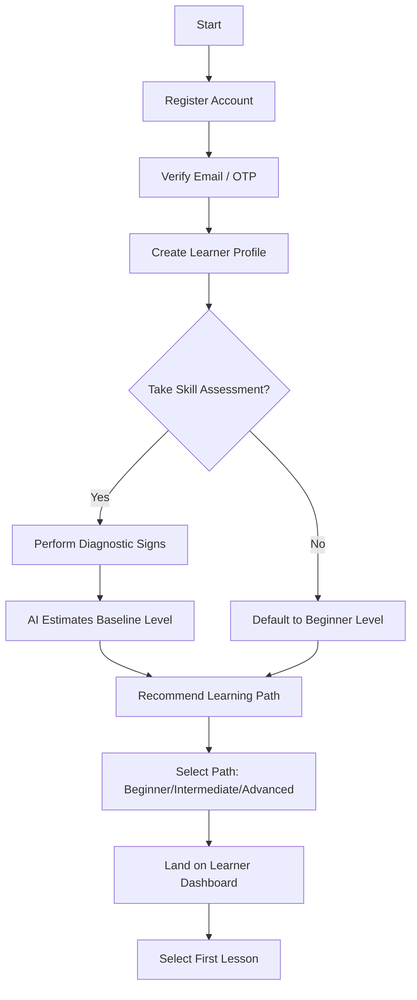

### 3.2 Returning Learner Workflow

A returning learner skips onboarding and resumes from their last known state.

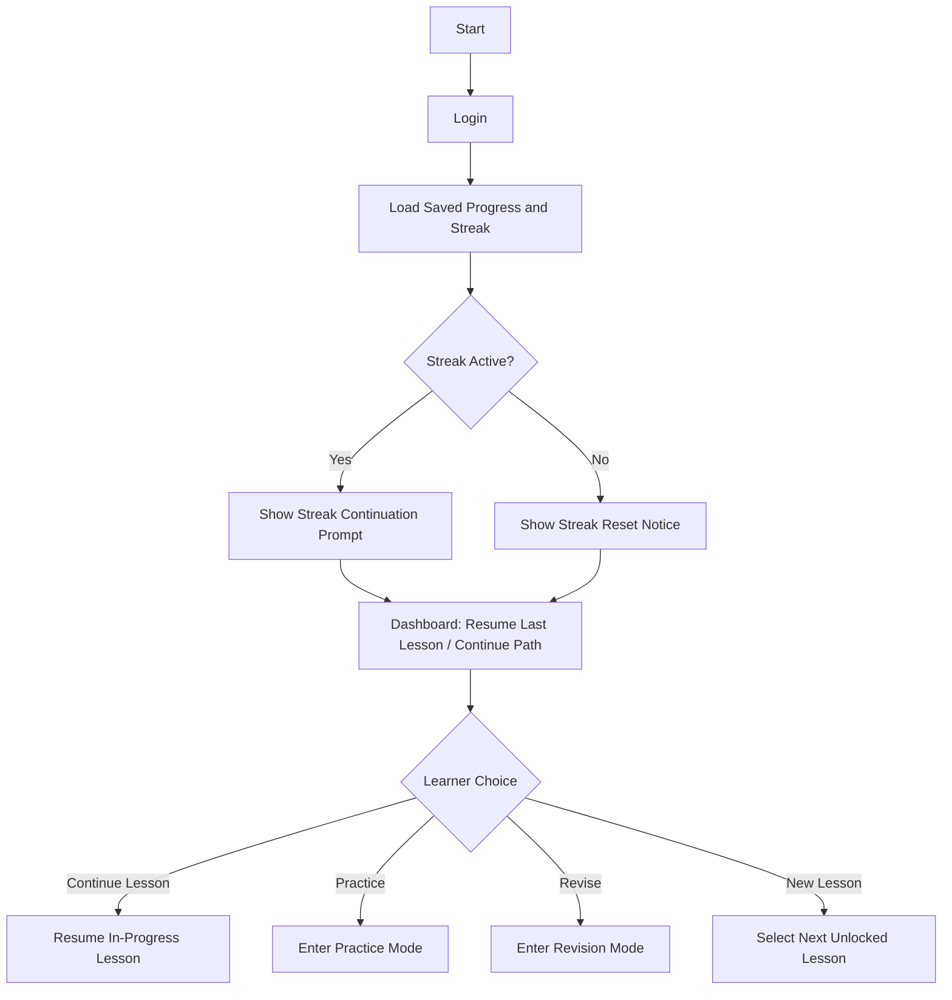

### 3.3 Practice Mode Workflow

Practice mode is ungraded and repeatable, intended for skill-building without affecting quiz scores.

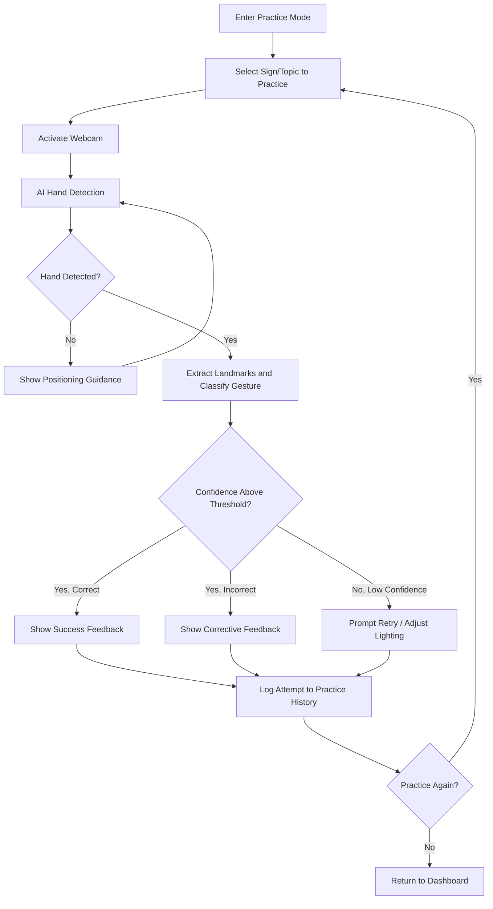

### 3.4 Assessment Mode Workflow

Assessment mode is graded: results feed quiz scores, progress tracking, and lesson-unlock decisions.

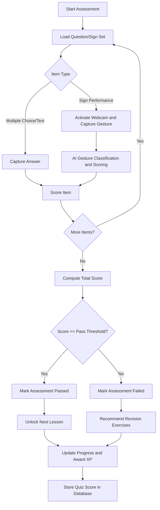

### 3.5 Revision Mode Workflow

Revision mode is system-triggered or learner-initiated and targets previously weak topics.

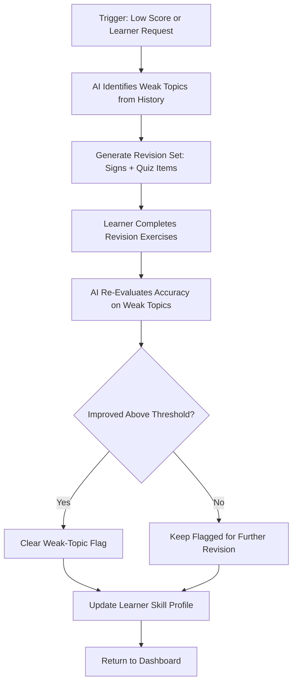

---

## 4. Core Workflow Diagrams

### 4.1 Main Application Workflow

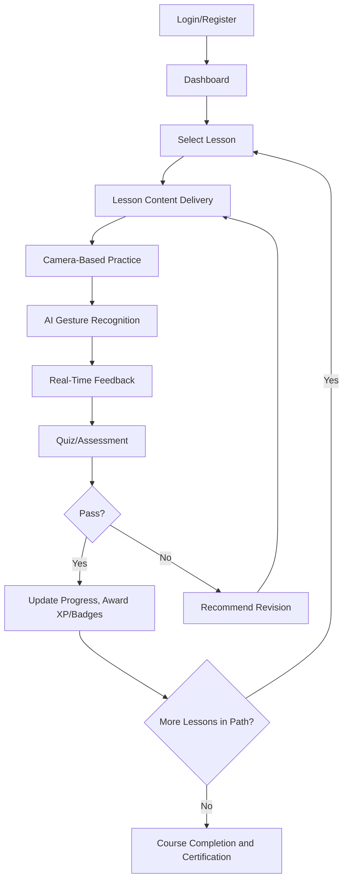

### 4.2 Lesson Workflow

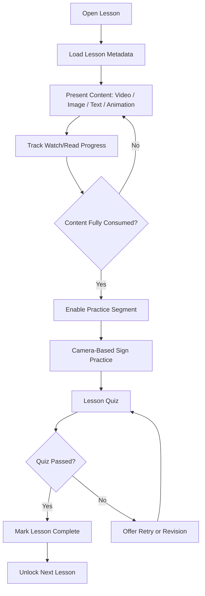

### 4.3 Practice Workflow (Sequence Diagram)

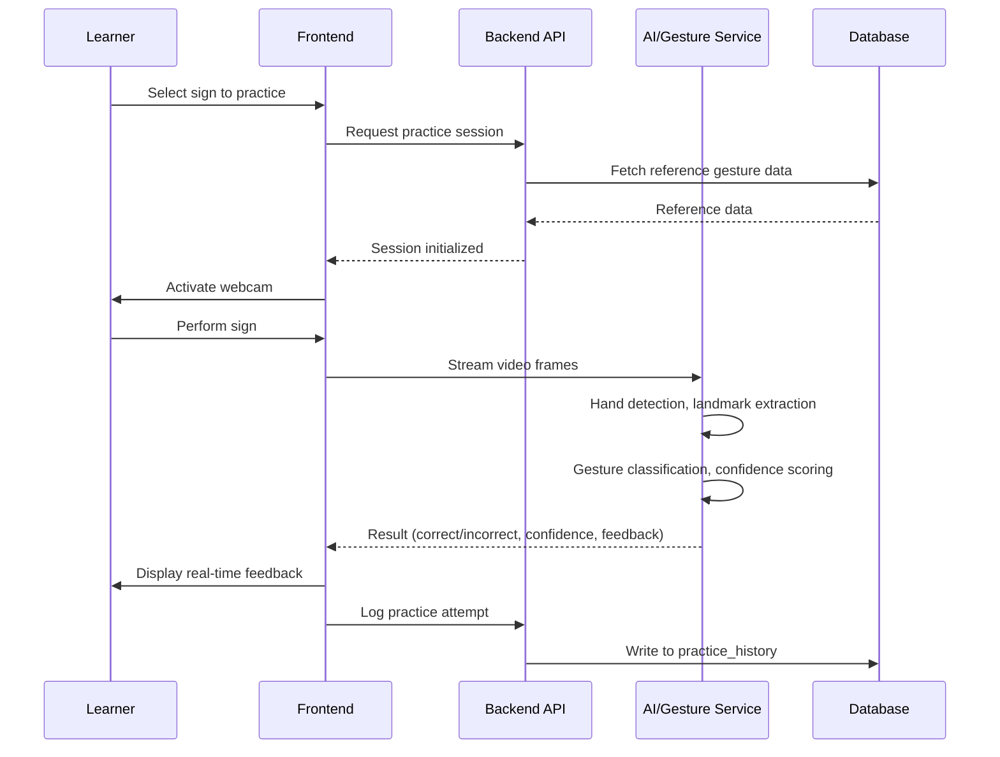

### 4.4 Assessment Workflow (Sequence Diagram)

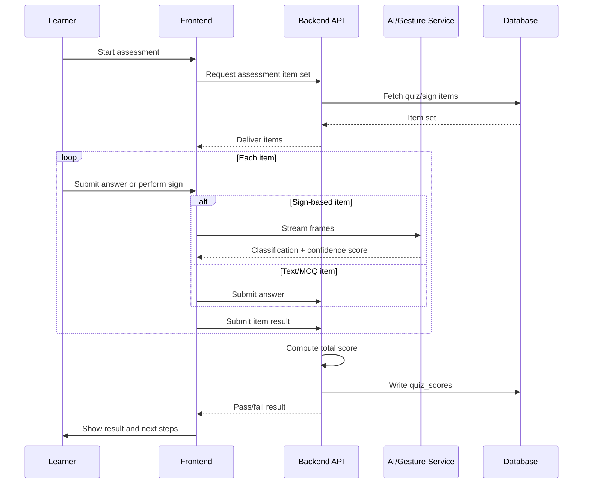

### 4.5 Progress Tracking Workflow

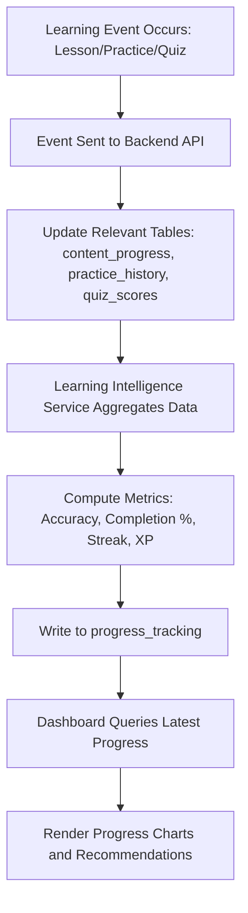

---

## 5. Decision Flows

The following decision logic governs correctness handling, quiz outcomes, and lesson completion.

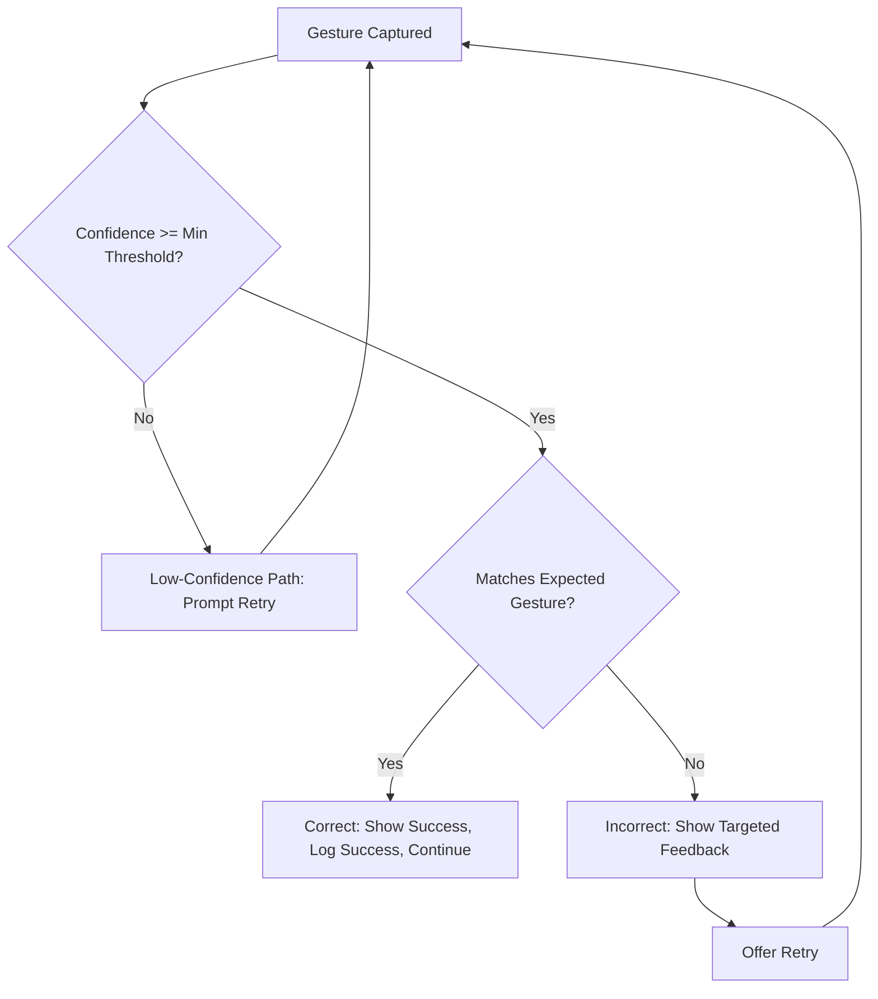

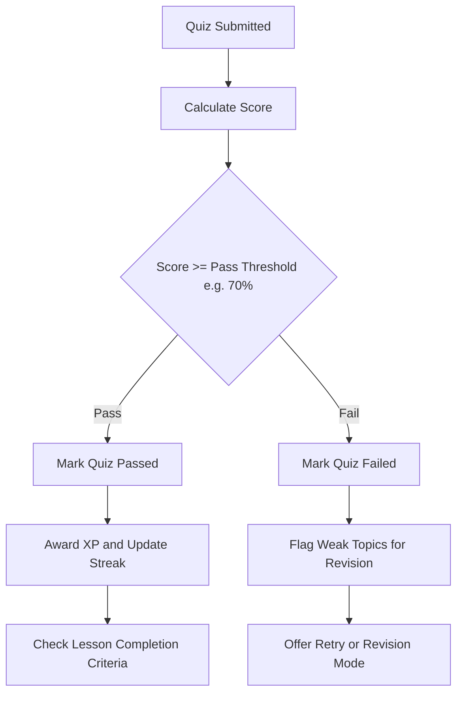

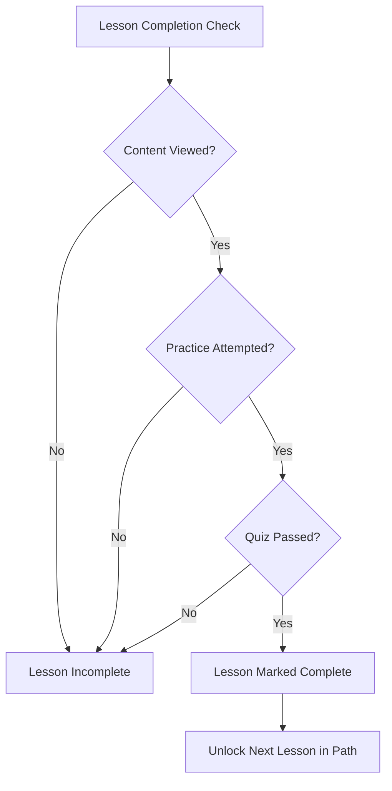

---

## 6. AI Interaction Workflow

This section details the AI gesture-recognition pipeline referenced throughout Sections 3–5, aligning with the Gesture Recognition Engine and Pose & Hand Tracking Engine defined in the System Architecture.

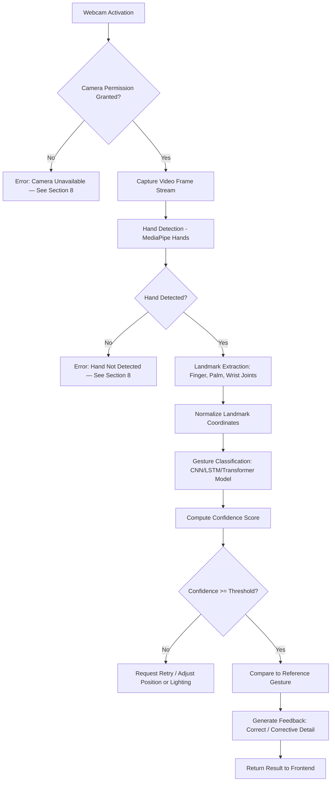

**Pipeline stage summary:**

| Stage | Description | Output |
|-------|-------------|--------|
| Webcam Activation | Frontend requests camera access via browser/device API | Live video stream |
| Hand Detection | MediaPipe Hands locates hand region(s) in frame | Bounding region, detection flag |
| Landmark Extraction | 21-point hand landmark model extracts joint coordinates | Landmark coordinate set |
| Gesture Classification | CNN (static signs) or LSTM/Transformer (dynamic signs) classifies the gesture | Predicted sign label |
| Confidence Score Calculation | Model outputs a probability/confidence value for the prediction | Confidence score (0–1) |
| Feedback Generation | System compares prediction and confidence against the expected sign | Correct/incorrect status, corrective message |

---

## 7. Database Interactions

Each learning workflow stage reads from or writes to specific data entities. This section consolidates database interaction points for backend and data-layer implementation.

| Workflow Stage | Data Stored/Read | Example Fields |
|-----------------|-------------------|-----------------|
| Registration/Login | User account | user_id, email, password_hash, role |
| Profile Setup | Learner profile | learner_id, name, preferred_language, learning_goals |
| Skill Assessment | Assessment results | assessment_id, baseline_level, per-topic accuracy |
| Path/Lesson Selection | Learner path, lesson metadata | path_id, current_level, lesson_id, module_id |
| Content Learning | Content progress | content_id, watch_percentage, completed_flag |
| Camera-Based Practice | Practice history | attempt_id, sign_label, confidence_score, result, timestamp |
| Real-Time Feedback | Feedback log | feedback_id, mistake_type, suggestion_text |
| Quiz/Assessment | Quiz scores | quiz_id, score, pass_flag, item-level breakdown |
| Progress Tracking | Progress metrics | accuracy_trend, completion_percentage, mastery_level |
| Gamification | XP, badges, streaks | xp_total, badge_ids, streak_count, last_active_date |
| Lesson Unlock | Unlocked lessons | learner_id, unlocked_lesson_ids |
| Certification | Certificates | certificate_id, course_id, issue_date |

**Notes:**
- `practice_history` and `quiz_scores` are the primary sources for the Learning Progress Intelligence Engine's accuracy and mastery calculations.
- `feedback_log` entries are retained to support the AI Feedback & Correction Engine's personalized improvement plans.
- All writes from the AI/Gesture Service pass through the backend API layer rather than writing to the database directly, preserving validation and audit logging.

---

## 8. Error Handling Workflows

Robust error handling is essential given the platform's dependence on camera input and real-time inference. The table and diagram below define detection and recovery behavior for common failure scenarios.

| Scenario | Detection Point | System Response | Recovery Path |
|----------|------------------|------------------|----------------|
| Camera unavailable | Webcam activation step | Display permission/hardware error message | Prompt to grant permission or select another device; fall back to text-based practice if unresolved |
| Poor lighting | Hand detection confidence consistently low | Display lighting guidance overlay | Suggest repositioning or increasing light; allow manual retry |
| Hand not detected | No hand region found in frame after N attempts | Display "position your hand in frame" guide | Show on-screen hand placement outline; retry detection loop |
| Low confidence prediction | Classification confidence below threshold | Withhold pass/fail judgment | Prompt retry; after repeated low confidence, offer a slowed-down reference video |
| Internet disconnected | API/network call failure or timeout | Display offline banner | Cache in-progress attempt locally; queue sync; retry submission on reconnect |

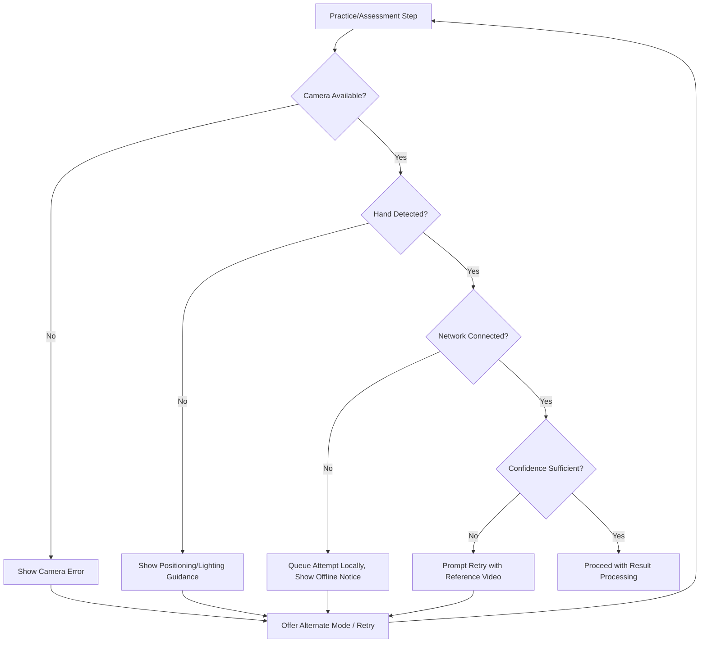

---

## 9. Gamification Workflow

Gamification elements reinforce consistent practice and reward measurable progress.

| Element | Trigger | System Action |
|---------|---------|-----------------|
| XP | Lesson completion, quiz pass, daily practice | Add XP to learner's total; update level if threshold crossed |
| Badges | Milestone reached (e.g., first lesson, 10-day streak, module mastery) | Award badge; store in `badges` collection; trigger notification |
| Daily Streaks | Learner completes at least one activity per day | Increment streak counter; reset on missed day |
| Leaderboards | Periodic aggregation (daily/weekly) | Rank learners by XP within cohort or global scope |
| Achievement Unlocking | Composite conditions met (e.g., accuracy + completion) | Unlock achievement, update learner profile |

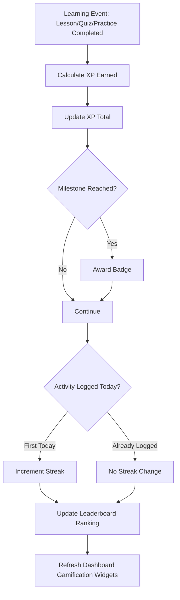

---

## 10. Adaptive Learning Workflow

The Learning Progress Intelligence Engine and Recommendation Engine use accumulated practice and assessment data to adjust the difficulty and content of upcoming lessons.

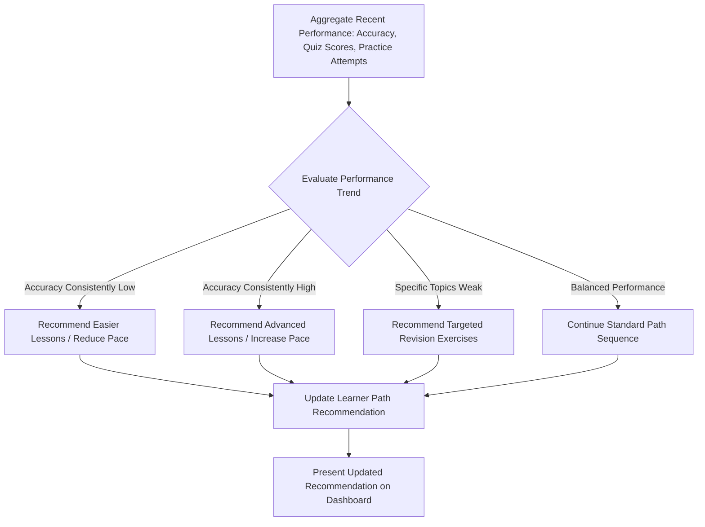

**Adaptive rules:**

| Condition | Threshold (indicative) | Recommendation |
|-----------|--------------------------|------------------|
| Low accuracy | Average sign/quiz accuracy below ~60% over recent attempts | Insert easier/simplified lessons; increase practice repetitions |
| High accuracy | Average accuracy above ~90% with fast completion | Skip ahead or surface advanced/optional lessons |
| Weak topic pattern | Repeated low scores on a specific sign category | Insert revision-mode exercises targeting that category |
| Stagnant progress | No improvement across multiple attempts on same item | Suggest a reference video walkthrough or instructor-led alternative |

---

## 11. Summary Tables

### 11.1 Workflow Stage Summary

| Workflow Stage | User Actions | System Actions | AI Actions | Database Operations | Output |
|-----------------|---------------|------------------|-------------|------------------------|--------|
| Registration/Login | Sign up, log in | Authenticate, issue JWT | — | Create/read `users` | Authenticated session |
| Profile Setup | Enter profile details | Persist profile | — | Write `learner_profiles` | Learner profile created |
| Skill Assessment | Perform sample signs | Present diagnostic items | Classify baseline signs | Write `assessment_results` | Baseline level |
| Path Selection | Choose/accept path | Filter catalog | Suggest path | Read `courses`, write `learner_path` | Assigned path |
| Lesson Content | Watch/read content | Stream content, track progress | — | Write `content_progress` | Content marked viewed |
| Camera Practice | Perform sign | Manage capture session | Detect hand, classify gesture | Write `practice_history` | Practice attempt logged |
| Real-Time Feedback | View feedback | Render feedback UI | Generate corrective message | Write `feedback_log` | Feedback shown |
| Quiz/Assessment | Answer/perform items | Score responses | Score sign items | Write `quiz_scores` | Pass/fail result |
| Progress Tracking | View dashboard | Aggregate metrics | Compute analytics | Read/write `progress_tracking` | Progress charts |
| Lesson Unlock | Advance | Verify completion criteria | Recommend next lesson | Read/write `unlocked_lessons` | Next lesson unlocked |
| Gamification | Earn XP/badges | Update XP/streak/leaderboard | — | Write `xp`, `badges`, `streaks` | Gamification state updated |
| Certification | Complete final assessment | Validate mastery criteria | Confirm mastery | Write `certificates` | Certificate issued |

### 11.2 Error Scenario Summary

| Scenario | System Response | Recovery |
|----------|-------------------|----------|
| Camera unavailable | Error message, alternate mode offered | Retry / grant permission |
| Poor lighting | Guidance overlay shown | Retry after adjustment |
| Hand not detected | Positioning guide shown | Retry detection |
| Low confidence prediction | Judgment withheld, retry prompted | Retry / reference video |
| Internet disconnected | Offline banner, local queuing | Auto-sync on reconnect |

---

## 12. Summary

This document defines the complete learning workflow for the AI-Powered Sign Language Learning & Assessment Platform, covering the end-to-end learner journey, mode-specific workflows (new/returning learner, practice, assessment, revision), the AI gesture-recognition pipeline, database interactions, error handling, gamification, and adaptive learning logic. It is intended to guide frontend, backend, and AI-service implementation and to serve as the workflow-design reference within the team's System Architecture and Learner Dashboard documentation.
