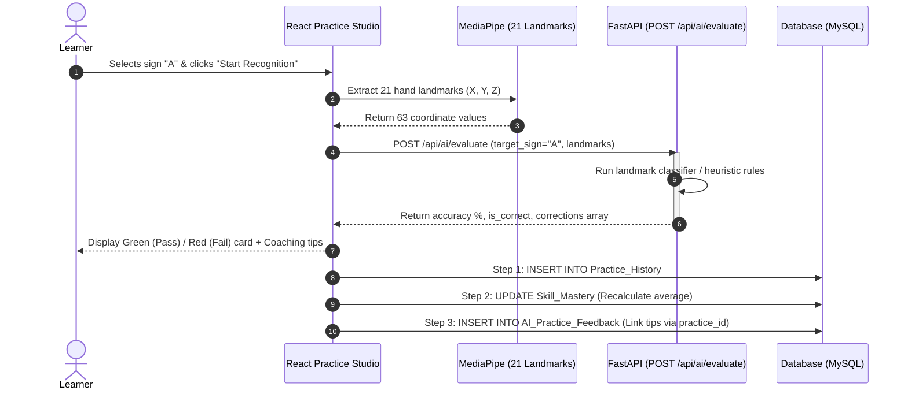

# Infosys Springboard Internship 2026 — Team 4
## Master Project Documentation (Milestone 1 & Milestone 2 Consolidated)

---

### Project Title
**Accessible Sign Language Learning & AI Gesture Assessment Platform**

---

## 👥 Team Roles & Milestone 2 Deliverables Summary

| Team Member | Role | Milestone 1 Deliverable | Milestone 2 Deliverable | Branch & Status |
| :--- | :--- | :--- | :--- | :---: |
| **Ankur Biswal** | Frontend / Full-Stack Lead | User Auth, RBAC, Profile & Dashboard Pages | AI Practice Studio, 60s Speed Quiz, Navbar update | `ankur/week2-milestone2` ✅ |
| **Chinmayee Badiger** | Backend & Dataset Lead | Dataset Pipeline & REST Endpoints | AI Gesture Evaluation API (`/ai/evaluate`), Dataset Library Page | `chinmayee-week2-milestone2` ✅ |
| **Pragathi** | Database Architect | 10 Normalized DB Tables, ER Diagram, Data Dictionary | AI Feedback & Quiz Tables (`AI_Practice_Feedback`, `Quiz_Scores`), Write-Flow SQL | `pragathi/week2-milestone2` ✅ |
| **Sirasana Gnana Prasanna Lakshmi** | API Analyst | API Specifications Document | 1068-line Gesture Recognition API Specs | `prasanna/milestone-2` ✅ |
| **Rishi** | Workflow Analyst | System Architecture & User Workflows | Sequence Diagrams for Live Practice, Exception Handling, Timed Quiz | `Rishi_team4/week2-milestone2` ✅ |
| **Adityakumar Thakur** | UI/UX Designer | Low-Fidelity UI Wireframes | Milestone 2 Low-Fidelity Screen Layout Specs | Pending Sync |

---

## 🏗️ System Architecture & Milestone 2 Integrations

### 1. Frontend Microservices (`/team_master/frontend`)
- **Framework**: React.js + TailwindCSS + Lucide Icons
- **Pages**:
  - `AuthPage.jsx` — Authentication & Live Role Switcher (RBAC)
  - `ProfilePage.jsx` — Learner Profile & Accessibility Settings
  - `DashboardPage.jsx` — Learning Progress Dashboard
  - `PracticeSessionPage.jsx` — Real-Time AI Camera Studio (MediaPipe 21-Landmarks)
  - `AssessmentQuizPage.jsx` — 60-Second Timed Speed Quiz
  - `DatasetLibraryPage.jsx` — Sign Language Dataset Repository & Metadata Explorer

### 2. Backend FastAPI Microservices (`/team_master/backend`)
- **Framework**: Python FastAPI + Pydantic v2
- **Endpoints**:
  - `POST /api/ai/evaluate` — Receives 21 landmark coordinates, evaluates accuracy, returns correction tips
  - `POST /api/ai/evaluate/detailed` — Debug endpoint returning top confidence and model metadata
  - `GET /api/ai/supported-signs` — List of 26 letters + 6 dynamic signs
  - `GET /api/ai/health` — AI engine & dataset pipeline health status

### 3. Database Architecture (`/team_master/database`)
- **Database Engine**: MySQL 8.0 / PostgreSQL
- **Normalized Tables (12 Total)**:
  - `Users`, `Learner_Profile`, `Courses`, `Lessons`
  - `Practice_History`, `Skill_Mastery`, `Assessments`, `Progress_Tracking`, `Feedback`, `Learning_Goals`
  - `AI_Practice_Feedback` (Milestone 2) — Stores MediaPipe landmark correction tips
  - `Quiz_Scores` (Milestone 2) — Logs speed quiz session metrics

---

## 🔄 End-to-End Gesture Evaluation & Logging Sequence

---

## 🎯 Verification & Demo Status

- ✅ All frontend components tested and verified in React.js.
- ✅ Backend API routers initialized with OpenAPI documentation at `/docs`.
- ✅ All Milestone 2 code consolidated into `team_master` folder.
- ✅ Ready for Thursday internal demo and Friday final presentation!
